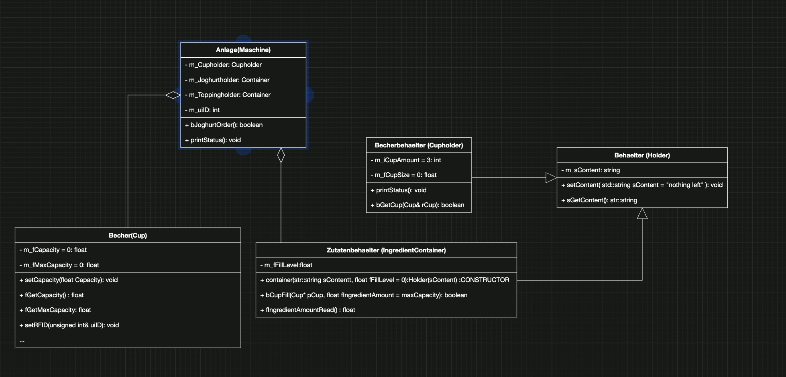

# jughurtMaschine

Anlage/Maschine Function
1. run bJoghurtOrder()
2. call getCup, if succeed then step 3.
3. it will request input('1','2','0'), if input right, go to step 4, else repeat request input.
4. case 0 : call setRFID(m_uiID) of one Cup; |
   case 1/2 : check storage and FillCup
5. if all succed return true.
